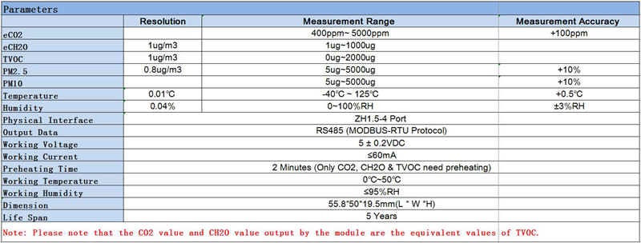
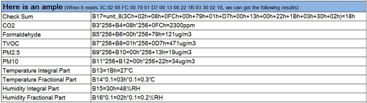

# Get CSV data from your SM300D2 air quality sensor

Fall 2020, Turin, Italy; lockdown is on. Living in a world full of fake news and deniers I wanted to understand the quality of the air in my home, using a data driven approach. After many researches I found a cheap (~ 50$ compared to the mean price of 100-200$+ in the market) 7 in 1 sensor that collects all the data I looking for. It's code name is SM300D2-V02, produced in Shenzen by SmartMeasure Inc. It collects temperature, humidity, particulates (PM10 and PM2.5), carbon dioxide, formaldehyde and volatile organic compounds.

This repository contains all the specs (very difficult to find) to connect this sensor via the RS-485 port to your computer and collect the data emitted into a CSV file. Enjoy!

## Plug'n'play

### Install repo dependecies
```
npm install
```

### Get the interface path
Plug the sensor via the RS-485 port to your computer and see which interface path uses.

In unix like OSes a useful command could be `dmesg | grep tty` (generally wants sudo).

Examples of paths you can obtains are: `/dev/ttyS0`, `/dev/ttyS1`, `/dev/ttyUSB0`, `/dev/ttyUBS1`

### Launch!

```
node log.js <interface-path> <output-path> <sampling (opt)>
```
| Parameter | Purpose | Default | Example
| ------ | ---- | ------- | ---|
| Interface path | Connect to the right serial port | None, you must provide | `/dev/ttyUSB0`
| Output path | The filename where will be written the CSV | None, you must provide | `/home/user/air-data.csv`
| Sampling | The sensor emits data every second; this parameter permits a longer sampling | `1` (in seconds), optional | `60`


A minimal configuration example to start from could be:
```
node log.js /dev/ttyUSB0 /home/user/air-data.csv
```
If you want to change the standard sampling, having for example one point data every 2 minutes (the script calculate the mean value in the interval):
```
node log.js /dev/ttyUSB0 /home/user/air-data.csv 120
```
The script will run forever until you manually stop it.

## SM300D2 specs


### RS-485 interface
| Name on board | Function |
| ------------- | ------------- |
| 5V | Power supply 5V  |
| B | RS-485 data port - |
| A | RS-485 data port + |
| GD | Ground wire |

| Configuration | Value |
| ------------- | ------------- |
| Baud rate | 9600 |
| Data bit | 8 bit |
| Stop bit | 1 bit |
| Parity bit | none |

### Data format
The data coming from the serial interface is organized in 17-bytes blocks.

| Byte # | Type | Meaning |
| ------ | ---- | ------- |
| 1 | Module address | Fixed value: 3Ch |
| 2 | Version number | Fixed value: 02h |
| 3 | Data | eCO₂ high byte |
| 4 | Data | eCO₂ lower byte |
| 5 | Data | eCH₂O high byte |
| 6 | Data | eCH₂O high byte |
| 7 | Data | TVOC high byte |
| 8 | Data | TVOC lower byte |
| 9 | Data | PM2.5 high byte |
| 10 | Data | PM2.5 lower byte |
| 11 | Data | PM10 high byte |
| 12 | Data | PM10 lower byte |
| 13 | Data | Temperature integer part |
| 14 | Data | Temperature fractional part |
| 15 | Data | Humidity integer part |
| 16 | Data | Temperature fractional part |
| 17 | Checksum | Checksum |

All the data comes in hexadecimal form and are calculated with the following algorithms (don't worry, this repo does the job!):


